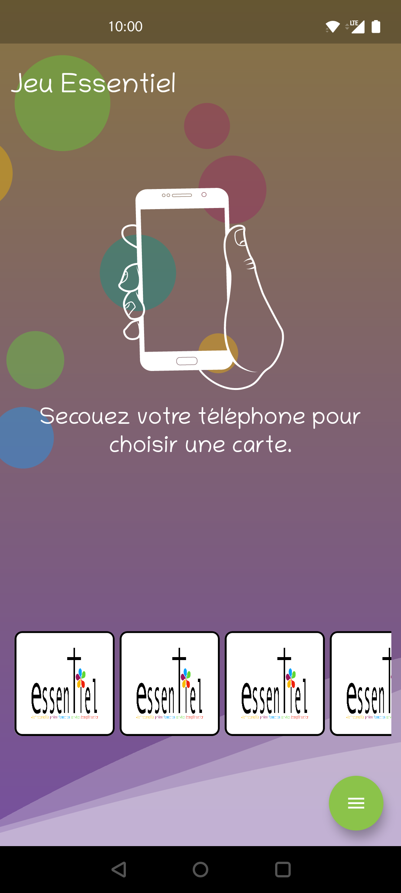

# Essentiel

Application pour les [groupes de partage Essentiel](https://www.saintemadeleinevilleurbanne.fr/groupe-essentiel/).

Cette application est développée et maintenue bénévolement pour la paroisse Sainte Madeleine des Charpennes de Villeurbanne.

<a href='https://play.google.com/store/apps/details?id=lemrapp.essentiel&hl=fr&gl=FR&pcampaignid=pcampaignidMKT-Other-global-all-co-prtnr-py-PartBadge-Mar2515-1'></a>

## Aperçu



Cette application est basée sur le kit de développement [Flutter](https://flutter.dev/),
dans le but de faciliter le développement et d'être multi-plateforme.

Les listes de questions et de catégories affichées dans le jeu
proviennent de la feuille de calcul disponible [ici](https://docs.google.com/spreadsheets/d/1cR8lE6eCvDrgUXAVD1bmm36j6v5MtOEurSOAEfrTcCI/edit#gid=0).

## Application Web

L'application est également disponible en version web, accessible directement depuis votre navigateur sans installation :

**Plateformes supportées:**
- **Mobile** : iOS Safari 17.2+, Chrome Mobile, Firefox Mobile
- **Desktop** : Chrome 120+, Firefox 121+, Safari 17.2+, Edge 120+
- **Tablette** : Optimisé pour les tailles d'écran intermédiaires

**Fonctionnalités:**
- ✅ Toutes les fonctionnalités de l'application mobile
- ✅ Responsive design adapté aux mobiles, tablettes et ordinateurs
- ✅ Support des gestes tactiles sur mobile (swipe, tap, pull-to-refresh)
- ✅ Support de la souris et du clavier sur desktop
- ✅ Mode hors ligne avec mise en cache des cartes
- ✅ Installation en tant que PWA (Progressive Web App)

**Déploiement local:**

Pour tester l'application web en local avec le backend API :

```bash
# 1. Démarrer les services backend et frontend avec Docker Compose
docker compose -f compose.yaml -f compose-dev.yaml up --build

# L'application web sera accessible sur http://localhost:8080
```

**Configuration:**
- Frontend : Nginx servant l'application Flutter web compilée
- Backend API : Serveur Go sur port interne, proxyfié par Nginx
- Redis : Cache pour les données Google Sheets

**Pour les développeurs:**
- Guide de test web : [docs/testing-web.md](docs/testing-web.md)
- Documentation backend API : [backend-api/README.md](backend-api/README.md)
- Configuration environnement : Voir `.env.example` pour les variables requises

## Services Backend (Docker Compose)

Le projet inclut désormais une API backend qui sert de proxy sécurisé pour accéder aux données Google Sheets depuis l'application web.

### Démarrer les services avec Docker Compose

```bash
# Copier le fichier de configuration d'environnement
cp .env.example .env

# Éditer .env avec vos identifiants Google Service Account
# - BACKEND_API_IMAGE: Image Docker à utiliser (optionnel, par défaut: ghcr.io/lemra-org/essentiel-backend-api:latest)
# - GOOGLE_SERVICE_ACCOUNT_JSON: JSON complet du compte de service
# - GOOGLE_SPREADSHEET_ID: ID de la feuille de calcul

# Démarrer tous les services (télécharge l'image depuis ghcr.io)
docker-compose up -d

# Voir les logs
docker-compose logs -f backend-api

# Arrêter les services
docker-compose down
```

**Note**: Docker Compose utilise l'image pré-construite depuis GitHub Container Registry (ghcr.io), publiée automatiquement par la CI/CD. Aucune construction locale n'est nécessaire.

L'API backend sera accessible sur http://localhost:8080 avec les endpoints:
- `GET /api/categories` - Liste des catégories
- `GET /api/questions` - Liste des questions
- `GET /healthz` - Vérification de santé

Voir [backend-api/README.md](backend-api/README.md) pour plus de détails sur l'API backend.

## Compiler le projet

- Installer Flutter:
  - soit conformément aux instructions officielles disponibles sur [cette page](https://docs.flutter.dev/get-started/install)
  - soit, si vous utilisez le gestionnaire de versions [`asdf`](https://asdf-vm.com/), à l'aide de cette commande: `asdf install`
- Installer les outils nécessaires pour Flutter (comme le SDK Android)
- Créer un project Google Cloud ainsi qu'un compte de service (utiles pour accéder aux APIs de Google pour lire la feuille de calcul qui sert de base de données). Plus de détails dans cet article "[How to Get credentials for Google Sheets](https://medium.com/@a.marenkov/how-to-get-credentials-for-google-sheets-456b7e88c430)" (en anglais). Les identifiants de ce compte de service serviront ensuite à créer un "environnement" de build dédié, comme indiqué ci-après.
- Préparer l'environnement (ignorer pour utiliser le mode de développement par défaut - cf. fichier [`lib/environments/dev.dart`](lib/environments/dev.dart)). Pour utiliser d'autres identifiants de compte de service, il suffit de créer un "environnement" dédié dans un nouveau fichier à placer dans le dossier `lib/environments`; par exemple: `lib/environments/staging.dart`:
```dart
import 'package:essentiel/env.dart';

void main() => Staging().init();

class Staging extends Env {
  final String saEmail = "Service Account Email Address";
  final String saId = "Service Account ID";
  final String saPK = "Fill Service Account Private Key";
}
```
- Connecter un périphérique (virtuel ou physique) à l'ordinateur, puis lancer la commande `flutter run [-t lib/environments/<mon_environnement.dart>]`

```bash
flutter run [-t lib/environments/<mon_environnement.dart>]
```

## Publier l'application

### Android

Le Play Store Google recommande la publication d'App Bundles pour optimiser le téléchargement des apps par les utilisateurs.
Pour créer un App Bundle, lancer la commande ci-après:

```bash
flutter build appbundle [-t lib/environments/<mon_environnement.dart>]
```

À la fin de cette opération qui ne dure que quelques minutes, un fichier `build/app/outputs/bundle/release/app-release.aab` devrait être créé.
Ce fichier devra ensuite être publié via l'interface Web du Google Play Store.

### iOS

Instructions à venir...

## Licence

    GNU AFFERO GENERAL PUBLIC LICENSE
    Version 3, 19 November 2007
